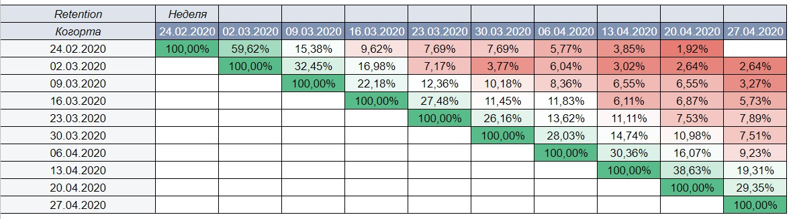
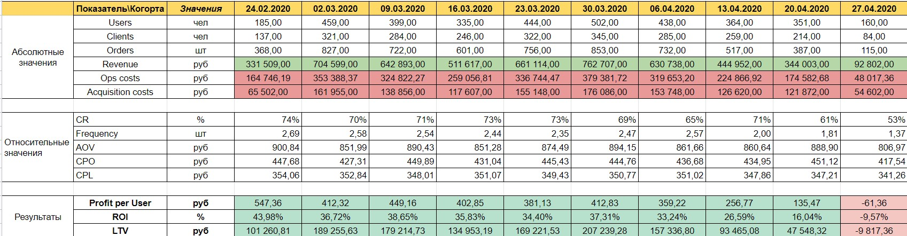
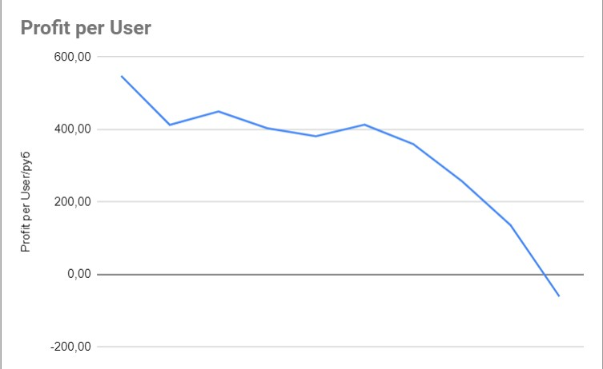
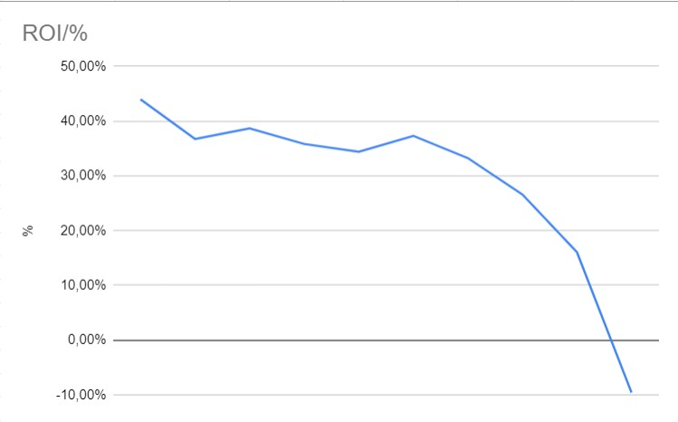
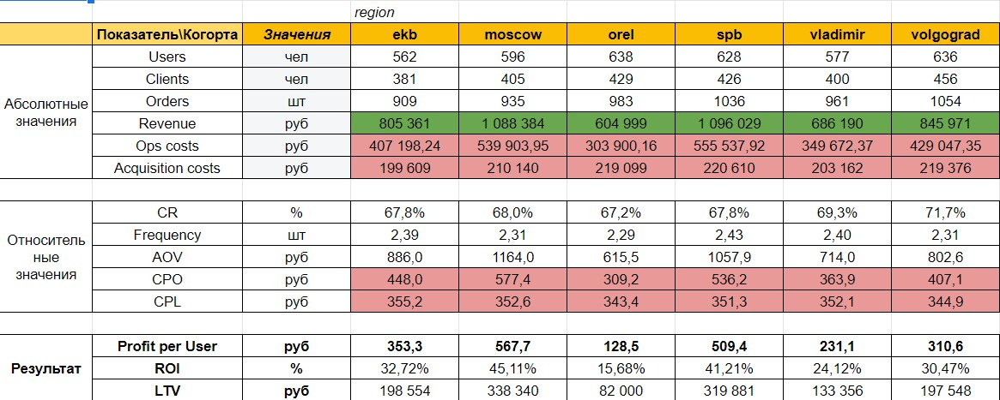
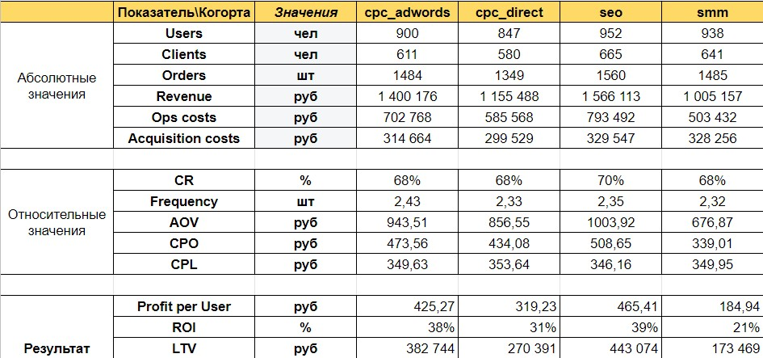

# Проект №1 - Retention. Когортный анализ посредством Google таблиц

## Постановка задачи

## Цель № 1
Определить маркетинговые и продуктовые показатели бизнеса в данный момент.

## Цель № 2

Определить, рентабельно ли масштабировать этот бизнес и открывать магазин в новом регионе.

Задачи

1) Вычислить недельную возвращаемость клиентов по недельным когортам. Датой отнесения к когорте будем считать дату первой покупки.
2) Вычислить показатели юнит-экономики для каждой недельной когорты. Датой отнесения к когорте будем считать дату первого визита.
3) Определить ROI, агрегированный за весь срок жизни когорт.
4) Определить три самых эффективных источника продвижения в метрике ROI.
5) Определить три самых эффективных города в метрике ROI.

## Комментарии

В отчёте приведены результаты работы с Google-таблицами: умение строить сводные таблицы, графики и диаграммы. Также был реализован когортный анализ.

## Результаты работы

### Задача 1
На рисунке представлена таблица, которая вычисляет недельную возвращаемость клиентов по недельным когортам.

### Задача 2

На данном рисунке представлены показатели юнит-экономики для каждой недельной когорты. Дата отнесения к когорте - дата первого визита.

### Задача 3

Определим ROI, агрегированный за весь срок жизни когорт.

### Задача 4

Когортный анализ по городам. Благодаря этому мы можем сделать вывод об эффективности городов в метрике ROI

### Задача 5

Когортный анализ по источникам трафика. Благодаря этому мы можем сделать вывод об эффективности источника продвижения в метрике ROI

